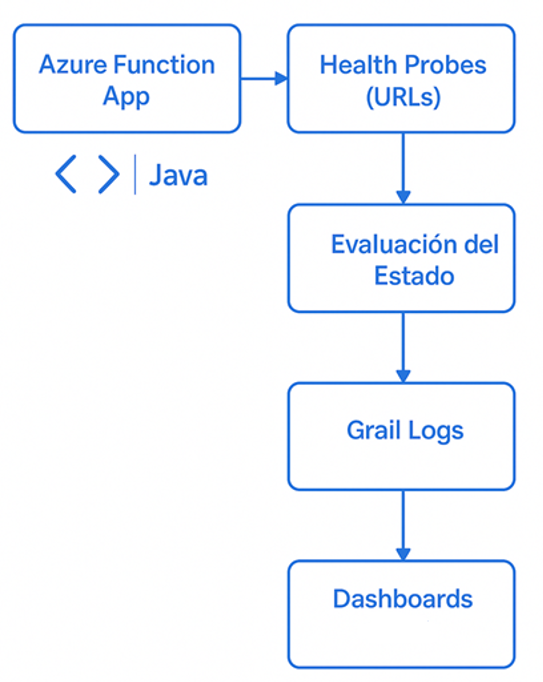

## 📚 Tabla de Contenidos

- [Resumen Ejecutivo](#-resumen-ejecutivo)
- [Arquitectura General](#-Arquitectura-general)
- [Requerimientos](#-requerimientos)
- [Instalación](#-instalación)
- [Uso](#-uso)
- [Contribución](#-contribución)
- [Roadmap](#-roadmap)
- [Autor](#-Autor)

---

 ### 📄 Resumen Ejecutivo

### Descripción
**FunctionAppJava** es una Azure Function desarrollada en Java que permite monitorear la disponibilidad de servicios web (endpoints HTTP) mediante health probes programadas. Se ejecuta automáticamente cada N minutos y envía los resultados a un sistema de observabilidad (Dynatrace Grail).

### Problema Identificado
En entornos productivos, la falta de visibilidad sobre la disponibilidad de aplicaciones web críticas puede derivar en pérdidas operativas y mala experiencia de usuario. Se requiere una solución proactiva, escalable y resiliente que realice validaciones constantes sin depender de herramientas manuales.

### Solución
Se implementó una Azure Function con:
- Lógica de reintentos y manejo de errores.
- Integración con observabilidad (Dynatrace).
- Configuración dinámica vía archivos JSON.
- Pipeline CI con Travis CI.
- Pruebas unitarias automáticas con JUnit y Mockito.

---

## 📐 Arquitectura General



```
┌─────────────┐        ┌────────────┐        ┌────────────┐
│ Timer Trigger│ ────▶ │ Java Azure │ ────▶ │ Dynatrace  │
│  (cada 30m) │        │  Function  │        │  Grail     │
└─────────────┘        └────────────┘        └────────────┘
                             │
                  ┌──────────▼─────────┐
                  │ Lectura de JSON    │
                  │ Validación HTTP    │
                  │ Logs + Retries     │
                  └────────────────────┘
```

- Tecnología principal: **Azure Functions en Java (Java 17)**
- Estilo de ejecución: **TimerTrigger configurado vía `App Settings`**
- Observabilidad: **Logs estructurados enviados a una API externa (Grail)**
- Código organizado bajo el patrón **modular single-class** con responsabilidad dividida por método

---

## 📁 Estructura del proyecto

```
FunctionAppJava/
├── src/
│   └── com.function/
│       └── MonitorWebAppAvailability.java
├── test/
│   └── com.function/
│       └── MonitorWebAppAvailabilityTest.java
├── .travis.yml
├── pom.xml
└── README.md
```

## 🧰 Requerimientos

### Infraestructura
- **Azure Function App** 
- **Dynatrace Grail** (para observabilidad)
- **Repositorio en GitHub**
- **Travis CI** (Integración continua)
- **Subscripción activa de Azure** (para depliegue)

### Software
- Java 17+
- Maven 3.8+
- Travis CI (con `.travis.yml`)
- Azure Functions Core Tools (para ejecución local)
- Visual Studio Code (IDE recomendado)
- Git

### Dependencias
```xml
<dependencies>
  <dependency>org.junit.jupiter:junit-jupiter:5.8.1</dependency>
  <dependency>org.mockito:mockito-core:3.12.4</dependency>
  <dependency>com.fasterxml.jackson.core:jackson-databind</dependency>
</dependencies>
```

---

## ⚙️ Instalación

### 1. Instalar Ambiente de Desarrollo
```bash
# Clonar el repositorio
git clone https://github.com/apsm1992/FunctionAppJava.git
cd FunctionAppJava
```
### 2. Generar archivo local.settings.json para variables de entorno local

```json
{
  "IsEncrypted": false,
  "Values": {
    "AzureWebJobsStorage": "UseDevelopmentStorage=true",
    "FUNCTIONS_WORKER_RUNTIME": "java",
    "ENDPOINTS_US": "[\"https://<endpoint-us>/probe\"]",
    "ENDPOINTS_EU": "[\"https://<endpoint-eu>/probe\"]",
    "GRAIL_ENDPOINT": "https://<tu-entorno>.live.dynatrace.com/api/v2/logs/ingest",
    "GRAIL_AUTH_TOKEN": "Api-Token <tu-token>",
    "MONITOR_SCHEDULE": "0 * * * * *"
  }
}
```

```bash
# Compilar proyecto
mvn clean install
```

### 3. Ejecutar Pruebas Manualmente

```bash
# Ejecuta pruebas unitarias
mvn test
```

### 4. Ejecutar function localmente
```bash
# Ejecuta pruebas unitarias
mvn azure-functions:run
```

### 5. Implementar en Producción (despliegue 🚀) 

Prerrequisitos:
- Tener configurado Azure CLI o Azure Portal
- Java 17 y Maven instalados
- Acceso a una Azure Subscription con permisos para crear Function Apps
- Configurar variables de entrono:

Estas variables deben definirse en el portal de Azure (Function App → Configuration):

| Variable             | Descripción                                         | Ejemplo                                     |
|----------------------|-----------------------------------------------------|---------------------------------------------|
| `MONITOR_SCHEDULE`   | Cron para ejecución periódica                       | `0 */5 * * * *` (cada 5 minutos)            |
| `ENDPOINTS_US`       | JSON con URLs a monitorear en US                    | `["https://us.api1.com", "https://us.api2"]`|
| `ENDPOINTS_EU`       | JSON con URLs a monitorear en EU                    | `["https://eu.api1.com"]`                   |
| `GRAIL_ENDPOINT`     | Endpoint real del API de observabilidad             | `https://grail.company.com/api/logs`        |
| `GRAIL_AUTH_TOKEN`   | Token Bearer para autenticación con Grail           | `Bearer eyJ...`                             |

---

```bash
# Usa este comando dentro del directorio raíz del proyecto:
func azure functionapp publish <NOMBRE_DE_TU_FUNCTION_APP> --java

```
Este comando:
- Empaqueta tu función.
- La sube a Azure.
- La despliega directamente en la Function App indicada.

---


## 🧑‍💻 Uso


### Manual del Administrador
1. Actualizar `local.settings.json` o variables de entorno para agregar/quitar servicios.
2. Verificar logs y dashboards en Dynatrace.
3. Monitorear actividad vía Travis CI o Azure Logs.

### 📊 Guía: Crear Dashboard en Dynatrace Grail

1. Accede al portal de Dynatrace: [https://<tu-entorno>.live.dynatrace.com](https://<tu-entorno>.live.dynatrace.com)
2. Dirígete a **Dashboards** > **Create dashboard**
3. Agrega un nuevo **tile** del tipo **Data Explorer**
4. En la sección de fuente de datos, selecciona **Logs (DQL)**

#### 📈 Consulta: Tiempo de respuesta promedio por URL

```dql
fetch logs 
| filter source == "MonitorWebAppAvailability"
| parse content, "JSON:data"
| fieldsAdd ResponseTime = data[responseTimeMs]
| fieldsAdd url = data[url]
| summarize avg(ResponseTime), by: {bin(timestamp,1m), url}
```

#### 📉 Consulta: Disponibilidad por minuto

```dql
fetch logs 
| filter source == "MonitorWebAppAvailability"
| parse content, "JSON:data"
| fieldsAdd status = data[status]
| fieldsAdd url = data[url]
| summarize `OK` = countIf(status == 200),
            `Fail` = countIf(status != 200) , by: {bin(timestamp,1m)}
```

5. Asigna nombre al tile (ej. "Tiempo de Respuesta" o "Disponibilidad WebApp")
6. Ajusta filtros de tiempo si es necesario (últimos 30 minutos, 1 hora, etc.)
7. Guarda el dashboard

Esto permitirá visualizar en tiempo real los resultados del monitoreo ejecutado por la Azure Function.
---

## 📌 Consideraciones

- Los logs contienen `timestamp`, `url`, `status`, `responseTimeMs`, `source`, `level`.
- En caso de fallos de conexión, se aplica backoff exponencial con reintentos.

---

## 🤝 Contribución

### ¿Cómo contribuir?

1. **Clona el repositorio**
```bash
git clone https://github.com/apsm1992/FunctionAppJava.git
cd FunctionAppJava
```

2. **Crea una nueva rama**
```bash
git checkout -b feature/nombre-de-la-tarea
```

3. **Realiza tus cambios y haz commit**
```bash
git commit -m "Descripción clara del cambio"
```

4. **Sube tus cambios**
```bash
git push origin feature/nombre-de-la-tarea
```

5. **Crea un Pull Request**
   - Desde GitHub: selecciona la rama y crea un PR hacia `develop`.
   - Espera revisión y aprobación para hacer merge.

---

## 🗺️ Roadmap

| Etapa | Tarea | Estado | Milestone |
|-------|-------|--------|-----------|
| GA    | Logging real con Grail | ✅ Completado | GA |
| GA    | Retry con backoff exponencial | ✅ Completado | GA |
| GA    | Test unitarios con JUnit | ✅ Completado | GA |
| GA    | Pipeline Travis CI | ✅ Completado | GA |
| FUTURO| Integrar alertas vía correo o Teams | 🔲 Pendiente | Futuro |


---

## 👤 Autor

- **apsm1992**  

---
